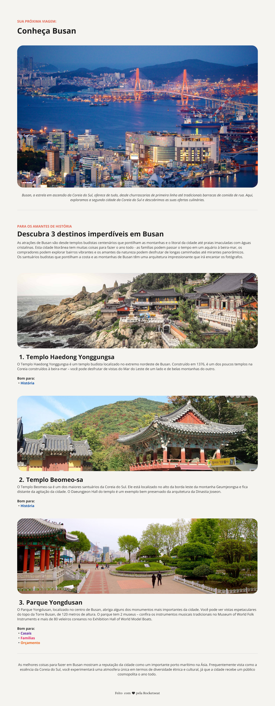

# Projeto Local Turístico
Olá, avançando nos conceitos básico de HTML e CSS esse projeto é um simples exemplo de como usar HTML e CSS feito pela Rocketseat.

Foram usados nesse exemplo listas, espaçamentos, ajuste de imagem, semântica e etc...

## Conhecendo Busan

